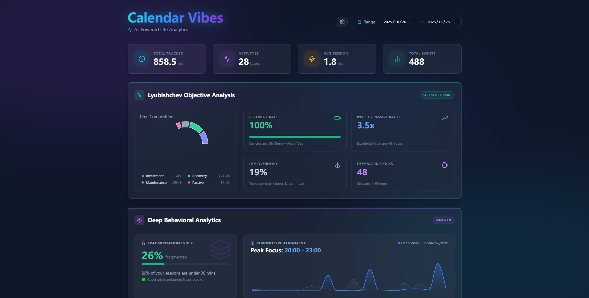
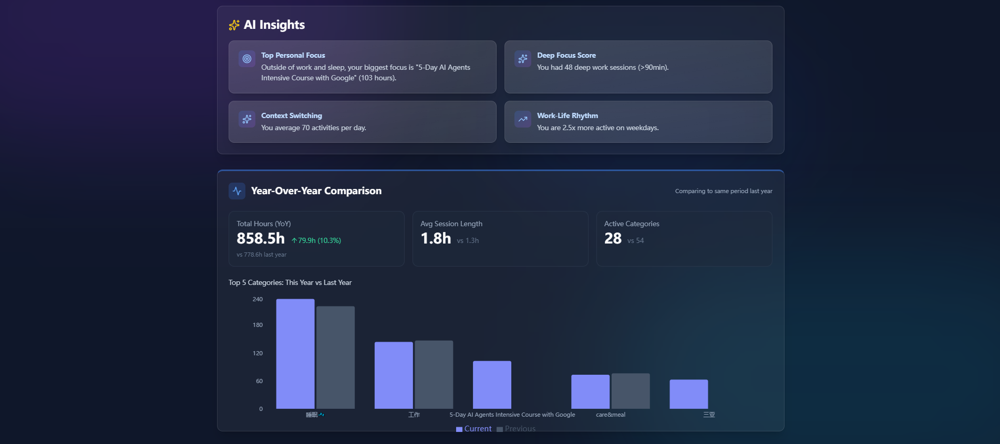
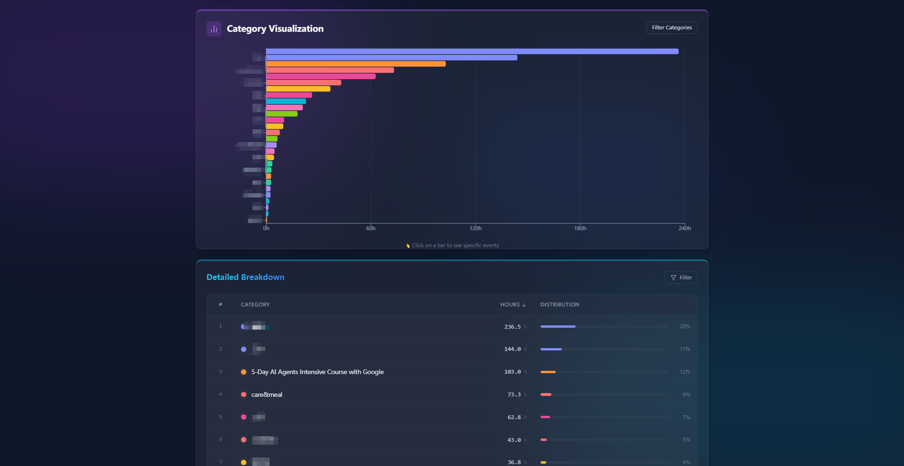

# 📅 Calendar Vibes

> **AI-Powered Life Analytics** - Transform your Google Calendar into actionable insights using cutting-edge AI and scientific time-tracking principles.


## 📸 Screenshots

### Dashboard Overview





---

## 🌟 What is Calendar Vibes?

Calendar Vibes is a **privacy-first**, **AI-enhanced** analytics dashboard that transforms your Google Calendar events into deep behavioral insights. Inspired by the time-tracking philosophy of Soviet scientist **Alexander Lyubishchev**, this tool goes beyond simple statistics to reveal patterns in your productivity, recovery, and life balance.

### 🎯 Key Features

- **🤖 AI-Powered Smart Categorization**  
  Leverages Google's Gemini API to intelligently classify activities into:
  - **Investment** (Deep work, coding, research)
  - **Recovery** (Sleep, gym, meditation)
  - **Maintenance** (Chores, commute, errands)
  - **Passive** (Entertainment, social media)

- **🔬 Lyubishchev Objective Analysis**  
  Scientific metrics inspired by the legendary time-tracker:
  - Recovery Rate vs. Benchmarks (8h/day)
  - Investment-to-Passive Ratio
  - Deep Work Block Count (>90 min sessions)

- **🧠 Deep Behavioral Analytics**  
  Advanced algorithms to detect:
  - **Fragmentation Index**: Measures context-switching overhead
  - **Chronotype Alignment**: Identifies peak productivity windows
  - **Burnout Radar**: Detects high-stress, low-recovery days

- **✨ Intelligent Data Normalization**  
  Automatically merges similar activities:
  - `IELTS` + `ielts` → `IELTS`
  - `Gym 💪` + `Gym` → `Gym 💪`
  - `Boxing 1` + `Boxing 2` → `Boxing`


- **🎨 Category Tuner (Human-in-the-Loop)**  
  Fine-tune AI classifications through an intuitive UI. Your corrections are cached for future accuracy.

- **📊 Rich Visualizations**  
  Built with Recharts:
  - Sunburst charts for category drilldown
  - Weekly activity trends
  - Hourly heatmaps
  - Year-over-year comparisons

---

## 🛠️ Tech Stack

### Frontend
- **React 19.2** with Vite (HMR for instant feedback)
- **Tailwind CSS** + **Framer Motion** (Glassmorphism UI with smooth animations)
- **Recharts** (Interactive data visualizations)
- **Lucide React** (Clean, modern icons)
- **Axios** (API communication)

### Backend
- **Node.js** + **Express** (RESTful API)
- **Google APIs** (OAuth2 + Calendar API)
- **SQLite** (Lightweight relational database with multi-user schema)
- **Gemini API** (AI-powered event classification)
  - Multi-model fallback: `gemini-2.5-flash` → `gemini-1.5-flash` → `gemini-pro`

### DevOps
- **Nodemon** (Hot-reload for backend)
- **dotenv** (Environment variable management)

---

## 🏗️ Architecture

### AI Classification Pipeline

```
┌─────────────────┐
│ Google Calendar │
│    Raw Events   │
└────────┬────────┘
         │
         ▼
┌─────────────────────────┐
│  Data Normalization     │
│  • Remove numbers       │
│  • Strip emojis         │
│  • Apply synonyms       │
│  • Uppercase canonical  │
└────────┬────────────────┘
         │
         ▼
┌─────────────────────────┐
│  Check Category Cache   │
│  (Previously classified)│
└────────┬────────────────┘
         │
         │ Cache Miss
         ▼
┌─────────────────────────┐
│   Gemini AI Batch       │
│   Classification        │
│   (User Persona-aware)  │
└────────┬────────────────┘
         │
         ▼
┌─────────────────────────┐
│  Store in Cache + DB    │
│  (Instant future hits)  │
└─────────────────────────┘
```

### Data Flow

1. **Authentication**: OAuth2 with Google (Offline access for tokens)
2. **Event Fetching**: Calendar API retrieves events for selected date range
3. **Normalization**: Events grouped by canonical keys (e.g., `IELTS` merges with `ielts`)
4. **Classification**: AI determines meta-category (Investment/Recovery/Maintenance/Passive)
5. **Analytics Engine**: 
   - Aggregates durations
   - Computes Lyubishchev metrics
   - Runs Deep Insights algorithms (Fragmentation, Chronotype, Burnout)
6. **Visualization**: React components render interactive charts

---

## 🚀 Getting Started

### Prerequisites

- **Node.js** (v18 or higher)
- **Google Cloud Account** (for Calendar API + OAuth2)
- **Gemini API Key** (from [Google AI Studio](https://makersuite.google.com/app/apikey))

### Installation

1. **Clone the repository**
   ```bash
   git clone https://github.com/YOUR_USERNAME/calendar_vibes.git
   cd calendar_vibes
   ```

2. **Install dependencies**
   ```bash
   # Install server dependencies
   cd server
   npm install

   # Install client dependencies
   cd ../client
   npm install
   ```

3. **Configure environment variables**

   Create `server/.env`:
   ```env
   GOOGLE_CLIENT_ID=your_google_client_id
   GOOGLE_CLIENT_SECRET=your_google_client_secret
   GOOGLE_REDIRECT_URI=http://localhost:3000/auth/google/callback
   GEMINI_API_KEY=your_gemini_api_key
   PORT=3000
   ```

   #### How to get Google OAuth credentials:
   1. Go to [Google Cloud Console](https://console.cloud.google.com/)
   2. Create a new project
   3. Enable **Google Calendar API**
   4. Create **OAuth 2.0 Client ID** (Web application)
   5. Add `http://localhost:3000/auth/google/callback` to Authorized redirect URIs
   6. Copy Client ID and Secret to `.env`

   #### How to get Gemini API Key:
   1. Visit [Google AI Studio](https://makersuite.google.com/app/apikey)
   2. Click "Get API Key"
   3. Copy the key to `.env`

4. **Start the application**

   **Terminal 1 (Backend):**
   ```bash
   cd server
   npm run dev
   ```

   **Terminal 2 (Frontend):**
   ```bash
   cd client
   npm run dev
   ```

5. **Access the application**
   - Open [http://localhost:5173](http://localhost:5173)
   - Click "Connect Google Calendar"
   - Authorize access
   - View your analytics! 🎉

---

## 📂 Project Structure

```
calendar_vibes/
├── client/                 # React Frontend
│   ├── src/
│   │   ├── components/    # UI Components
│   │   │   ├── Dashboard.jsx
│   │   │   ├── CategoryTuner.jsx
│   │   │   ├── LyubishchevPanel.jsx
│   │   │   ├── DeepInsightsPanel.jsx
│   │   │   └── charts/
│   │   │       ├── CategoryDrilldown.jsx
│   │   │       └── WeeklyBar.jsx
│   │   └── App.jsx
│   └── package.json
│
├── server/                # Express Backend
│   ├── index.js          # Main server + AI logic
│   ├── db.json           # LowDB storage (tokens + cache)
│   ├── .env              # Environment variables (DO NOT COMMIT)
│   └── package.json
│
├── LESSONS_LEARNED.md    # Engineering insights
└── README.md             # You are here
```

---

## 🎨 UI/UX Design Philosophy

This app follows the **"Sizzling Vibes"** aesthetic:
- **Glassmorphism**: Frosted glass cards with backdrop blur
- **Neon Accents**: Vibrant gradients (cyan → blue → purple)
- **Micro-animations**: Framer Motion for smooth transitions
- **Dark Mode First**: Optimized for late-night data analysis

---

## 🧪 Core Algorithms

### 1. Fragmentation Index
```
Score = (Short Sessions < 30min / Total Sessions) × 100
Level: Low (<30%) | Moderate (30-50%) | High (>50%)
```

### 2. Chronotype Alignment
Identifies the 3-hour window with maximum Investment activity to detect your peak performance hours.

### 3. Burnout Radar
```
Risk = High if > 2 days with:
  - Investment > 6h AND
  - Recovery < 6h
```

---

## 🔮 Future Roadmap

- [ ] **CSV/JSON Export** for custom data analysis
- [ ] **Deployment** (Vercel frontend + Railway backend)
- [ ] **Mobile Responsive** design
- [ ] **Custom Personas** (let users define their own AI classification logic)
- [ ] **Weekly Email Reports** with insights
- [ ] **PostgreSQL Migration** (scale beyond SQLite) - See [SCALING.md](./SCALING.md)
- [ ] **Dark/Light Theme Toggle**
- [ ] **Multi-calendar Support**
- [ ] **Multi-user SaaS** (authentication + billing)

> **Note**: For detailed commercialization strategy, see [SCALING.md](./SCALING.md)

---

## 🤝 Contributing

Contributions are welcome! Please feel free to submit a Pull Request.

---

## 📄 License

MIT License - feel free to use this for your own projects!

---

## 🙏 Acknowledgments

- Inspired by **Alexander Lyubishchev**'s time-tracking methodology
- Built with **Google Gemini AI**
- UI inspired by modern design systems (Vercel, Linear, Stripe)

---


